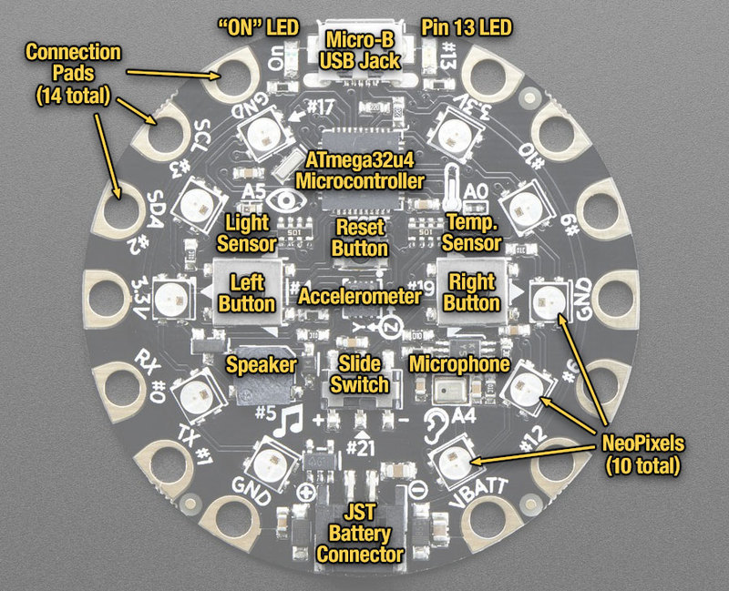

# HardwareLou_CircuitPlayground

Circuit Playground Demos &amp; Tutorials for Louisville Hardware Meetup

## Getting Started

#### Project Overviews

<u>Snap</u> - The board listens for a loud noise (SNAP!) and changes the pattern and color of the neopixels.

<u>Neopixel Play</u> - Adjust the color of the neopixels using the boards touch pads.

<u>Keyboard</u> - Use the capacitive touch pads to play a keyboard. 

<u>Cricket</u> - The board makes noises based on how much light the sensor detects.

#### CircuitPlayground Tooling

Each directory has two sets of code files. 

- `.ino` files are Arduino source files
- `.py` files are CircuitPython source files

While the hardware can be used with Arduino and CircuitPython the libraries,
bootloader and tools are different. 

If you plan on using Arduino based tooling get started [here](https://learn.adafruit.com/adafruit-circuit-playground-express/arduino)

For CircuitPython start [here](https://learn.adafruit.com/adafruit-circuit-playground-express/circuitpython-quickstart)

#### CircuitPlayground Library Reference Docs

The CircuitPlayground boards have libaries available for both Arduino and CircuitPython
that make interacting with the boards sensors easier.

- [Arduino](https://caternuson.github.io/Adafruit_CircuitPlayground/)
- [CircuitPython](https://circuitpython.readthedocs.io/projects/circuitplayground/en/latest/api.html#adafruit-circuitplayground-express)

-----

-----

# What is Circuit Playground?

[Circuit Playground](https://learn.adafruit.com/circuit-playground-lesson-number-0/intro) is round circuit board developed by [Adafruit](https://www.adafruit.com/) meant to be an approachable, robust, and relatively low cost way for developers to explore and prototype their programmable hardware ideas.

It's an [Arduino](https://www.arduino.cc/) based chip, chock full of all sorts of interesting things and sensors to work with.

## The Bits and Bobs

#### Power

The Circuit Playground can be powered two different ways - either by USB connector or portable USB power or battery pack. The USB connection allows power and programming capabilities, while the battery connection is only for power - but allows you to be more mobile with your chip.

> Make sure if you're using the USB cable connector, you're using one rated for data AND power. Often lots of charing cables will carry a charge, but won't do data - leaving you a very frusterated programmer!

The chip, and the battery pack connector, is also <u>designed for beginners</u> so it has some protection and *regulation* circuitry so that it is flexible about how it is powered. In particular there is a polarity protection diode (to avoid destroying the board if you have a backwards-connected battery). It also has an **onboard 3.3V Power Supply** - meaning you can power it from anywhere between 3.5V up to 6.5V and it will automatically *regulate* it down to a clean 3.3V. Now, when powering Circuit Playground, you can draw at *most 5*00 milliAmps of current. This is not a guarantee because you also have to make sure that the regulator doesn't overheat.

#### Main Chip

The Circuit Playground CPU / microcontroller is called the ATmega32u4 and it has:

- 44 Pins
- Powered by 3 Volts
- Requires about 0.1 Watts of power
- Runs at 8 MHz
- 32 KB of flash storage
- ~2 KB of RAM
- Costs about $5 per

#### Neopixels

The Circuit Playground has 10 [Neopixels](https://learn.adafruit.com/adafruit-neopixel-uberguide) which basically act as full color LEDs - they have separate RGB (red / green / blue) levels that can be programmed independently of the other. At full brightness the light looks white, but by scaling back the different levels at separate rates you can simulate a wide rainbow range!

These pixels are controlled by a single data pin, **#17**. Unlike non-smart RGB LEDs, you can set the color and a little chip inside the LED will handle the PWM for you.

#### Motion Sensor (Triple-axis accelerometer)

There is a powerful MEMS accelerometer in the very center of your Circuit Playground. This part is the LIS3DH, a 3-axis (X, Y and Z) sensing accelerometer. Accelerometers are the sensors in your WiiMote, phone, and other electronic devices that can sense tilt, gravity, motion and 'tap' effects. These sensors used to cost $20 each but now are so common we can include them for beginners!

The sensor can sense ±2*g*, 4*g*, 8*g* (*g* = 9.8 meters/s2). Of course, at all times on earth you will sense 1 *g* of gravity!

The LIS3DH is connected to the hardware SPI pins (to leave the I2C pins free) and has the chip select (CS) pin on digital pin **#8** and an optional interrupt output on digital pin **#7** (also known as IRQ #4)

#### Temperature Sensor (thermistor)

You can sense the temperature using the onboard thermistor. A thermistor is a resistor that changes it's resistance based on the temperature. They are a *little* more complex to use than temperature sensors that spit out Celsius, but they're also much less expensive.

We use the NTC thermistor ([Murata NCP15XH103F03RC](https://cdn-shop.adafruit.com/product-files/3000/NCP15XH103F03RC.pdf)) for temperature sensing. While it isn't an all-in-one temperature sensor, with linear output, it's easy to calculate the temperature based on the analog voltage on analog pin **#A0**. There's a 10K 1% resistor connected to it as a pull down. [You can read the analog value and calculate the temperature with the beta-constant](https://learn.adafruit.com/thermistor/), or just use the Circuit Playground library

#### Light Sensor (phototransistor)

With this sensor, you can determine the brightness of your surroundings!

This sensor is connect to analog pin #**A5**, you can use analogRead or the library to read the analog value. It will read between 0 and 1023 with higher values corresponding to brighter light levels. The range is approximately 0 Lux to 1500 Lux maximum.

#### Sound Sensor (MEMS microphone)

Listen to your surroundings with this sound sensor...

A thin [MEMS microphone](https://en.wikipedia.org/wiki/Microphone#MEMS_microphone) can be used to detect audio levels and even perform basic FFT functions. You can read the analog voltage corresponding to the audio on analog pin **#A4**. Note that this is the raw analog audio waveform! When it's silent there will be a reading of ~330 and when loud the audio will read between 0 and 800 or so. Averaging and smoothing must be done to convert this to sound-pressure-level.

The microphone is sensitive to 100 Hz - 10,000 Hz audio frequencies. [See the datasheet for more details.](https://cdn-shop.adafruit.com/product-files/3000/SPW2430HR5H-B.pdf)

#### Mini speaker (Magnetic piezo buzzer)

You can make your circuit playground sing with the built in buzzer. This is a miniature magnetic speaker connected to digital pin **#5** with a transistor driver. It is quite small but can beep with conviction! It's not good for playing detailed audio, more for beeping and buzzing and simple bleepy tunes.

#### Push Buttons x 2

What it sounds like! Cute adorable buttons to push, one left and right of the microcontroller.

- The **Left** button is connected to digital pin **#4**
- The **Right** button is connected to digital pin **#19**

#### Slide Switch

A simple slide switch. A nice way to either deactivate your board, flip between demo / live versions or different versions of a program.

The switch is connected to **digital pin #21**.

#### Clip friendly I/O pins (w/ capacitive touch inputs)

All 8 non-power pads (e.g. not the GND/3.3V/VBATT) around the Circuit Playground have the ability to act as capacitive touch pads. Each pad has a 1 MΩ resistor between it and digital pin #30. You can toggle this pin in your sketch to control whether the resistor is a pullup or pulldown or floating. Note that this means that all the pads have a 2 MΩ resistance between them, not important for 99% of uses but may be confusing for some cases where you are trying to detect very high resistance values

##### Left Side

Starting from the Micro USB jack and going clockwise here are what the pins do.

- **3.3V** - this is the *output* from the onboard 3.3V power supply. This is the main power voltage for the 'Play but can also be used to power sensors, GPS or bluetooth modules, etc. You can draw a maximum of 500mA. See the **Battery Jack & Supply** page for more details
- **#10** - this is connected to the microcontroller's pin #10. This pin can also be used for *analog inputs* and is called **A10**. It can also act as a **PWM** output.
- **#9** - this is connected to the microcontroller's pin #9. This pin can also be used for *analog inputs* and is called **A9**. It can also act as a **PWM** output.
- **GND** - shorthand for **Ground** you'll need to this when powering or connecting to external devices.
- **#6** - this is connected to the microcontroller's pin #6. This pin can also be used for *analog inputs* and is called **A7**. It can also act as a **PWM** output.
- **#12** - this is connected to the microcontroller's pin #12. This pin can also be used for *analog inputs* and is called **A11**. It can also act as a **PWM** output.
- **VBATT** - this is the battery voltage *output* from whichever is higher: the JST battery pack or USB. *It cannot be used as a power input!* It is designed to power high-current or high-voltage devices that need more like 5V than 3.3V. If connected to USB, this pin provides 5V. If powered from battery, the output voltage will vary depending on the battery pack.

##### Right Side

Starting from the Micro USB jack and going counter-clockwise here are what the pins do.

- **GND** - Same as the other **Ground** pins
- **SCL #3** - This is a special-purpose pin. It is connected to the microcontroller's pin #3. This pin can also act as a **PWM** output and an **interrupt** input (INT0). The other special usage is connecting to I2C sensors and devices, as the I2C Clock pin
- **SDA #2** - This is a special-purpose pin. It is connected to the microcontroller's pin #2. This pin can also act as a **PWM** output and an **interrupt** input (INT1). The other special usage is connecting to I2C sensors and devices, as the I2C Data pin
- **3.3V** - Same as the other **3.3V** power supply pins
- **RX #0** - This is a special-purpose pin. It is connected to the microcontroller's pin #0. This pin can also act as an **interrupt** input (INT2). The other special usage is connecting to UART/Serial sensors and devices, as the Data Receive (RX) pin.
- **TX #1** - This is a special-purpose pin. It is connected to the microcontroller's pin #1. This pin can also act as an **interrupt** input (INT3). The other special usage is connecting to UART/Serial sensors and devices, as the Data Transmit (TX) pin.
- **GND** - Same as the other **Ground** pins

#### Basic LEDs

**ON** LED - this LED will shine green whenever the Circuit Playground is powered. Helps debug issues with the board - it should be a constant green, if it's flickering or off then you should check your power supply!

**#13** LED - this is the one LED that you can control. The ON lights up automatically no matter what. The **#13** LED, however, is connected to one of the main microcontroller's pins and you can turn it on or off when you start writing code. This LED also pulses to let you know when the *bootloader* is active and ready to receive a program.

#### Reset Button

A quick way to turn your Circuit Playground off & on again without needing to cycle the power. A good way to reset your program if it's gotten itself into a bad state.